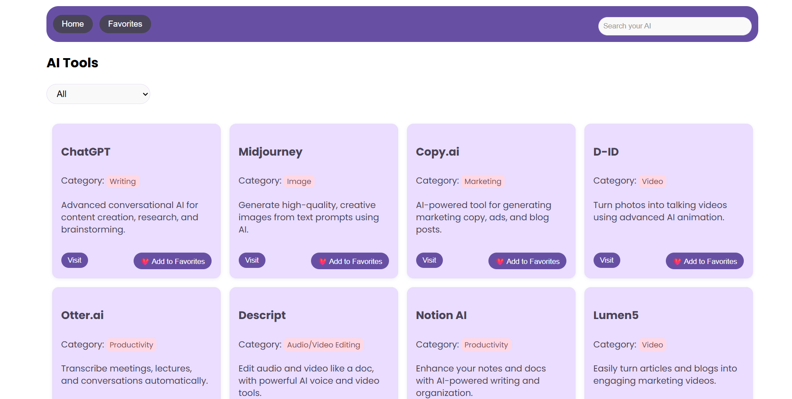
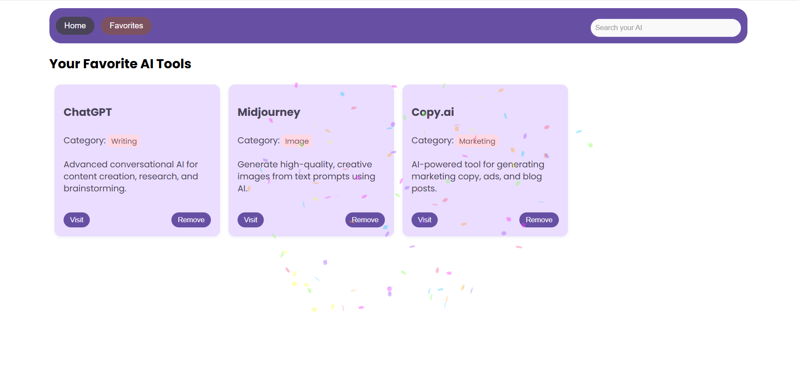

# 🧠 AI Tools Explorer

A beginner-friendly **React + Node.js** project to browse, search, and favorite AI tools. Includes search, category filtering, confetti animations, and a beautiful responsive UI.

---

## 🌟 Features

- 🔍 **Search** AI tools by name
- 📂 **Filter** by category dropdown
- ❤️ **Add/Remove** tools to/from favorites
- 📱 **Mobile Responsive UI**
- 🎉 **Confetti animation** on adding to favorites
- ⚡ Built with beginner readability and simplicity

---

## 📸 Screenshots

### 🏠 Home Page



### ❤️ Favorites Page



---

## 📁 Folder Structure

```
├── client/ # React frontend
│ ├── components/ # Navbar, Home, Favorites
│ ├── Services/ # Axios API functions
│ └── App.js

├── server/ # Node.js backend
│ ├── routes/ # API endpoints
│ ├── controllers/ # Request handling
│ ├── models/ # MongoDB models
│ └── server.js # Express server entry
└── README.md
```

## 🚀 Getting Started

### 0️⃣ Download Zip 
```
https://github.com/Harmandeep01/AI-tools.git
```

### 1️⃣ Backend Setup

```bash
cd server
npm install
npm start
```

2️⃣ Frontend Setup

```
cd client
npm install
npm start
```

⚠️ **Important Note**:

- The React app runs on **port 3000 by default**. If the terminal suggests a different port (like 3001), press **Y** to accept.
- The server runs on **port 8000 or 8080**, depending on your configuration.
- Make sure both the frontend and backend are running for full functionality.
- Ensure that your frontend (client)  fetches (http://localhost:8080/api) APIs from the same origin where your backend (server) is hosted http://localhost:8080/api. This helps avoid CORS issues when deploying or running both locally. 

## 🔧 Backend API Routes

| Route                | Method | Description                  |
| -------------------- | ------ | ---------------------------- |
| `/api/tools`         | GET    | Get all AI tools             |
| `/api/favorites`     | GET    | Get all favorite tools       |
| `/api/favorites/:id` | POST   | Add a tool to favorites      |
| `/api/favorites/:id` | DELETE | Remove a tool from favorites |

# 🧰 Tech Stack

    Frontend: React, CSS (Inter & Poppins fonts), Axios

    Backend: Node.js, Express.js

    Database: local

    Extras: Confetti.js, Responsive Design

# 🙋 Author

Made with ❤️ by a beginner diving into full-stack development.

# 📃 [License](LICENSE.txt)

## 🔗 Links

[](https://www.linkedin.com/in/harmandeep01/)
[](https://twitter.com/)
